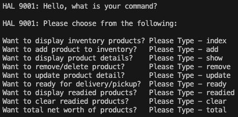

# Command-Line-Inventory-App

## Description

- I am building a fully functional inventory app that includes both front and back end functionality, and this command-line-inventory-app is a dry run of what kind of user interaction and functionality the react app will need. 
- I am building the react inventory app to help users that need better control of their inventory in a freezer warehouse.
- There are many inventory control programs and app out there.  My version is just another option out there for businesses.
- For the command-line-inventory-app, I learn to write functions and console log the response based on the user input.  This is very important when I build the back end to my React Inventory App

## Table of Contents

- [Installation](#installation)
- [Usage](#usage)

## Installation

To install this app, fork and clone to your local machine and type the following in terminal to install all dependencies.

```
npm i
```

## Usage

To begin interaction with app, type the following in the terminal.

```
npm run start
```

You will be greeted to HAL 9001, the companion to this command-line app.  Just follow the prompts to use the different functionalities provided by the app.  The following is an screenshot of all the prompts.




## Badges


## Features

This app uses the node built-in <a href="https://nodejs.org/api/readline.html">Readline</a> and <a href="https://nodejs.org/api/fs.html">File system</a> packages, and uses the <a href="https://www.npmjs.com/package/nanoid">nanoid version 3</a> package to generate random ids.
